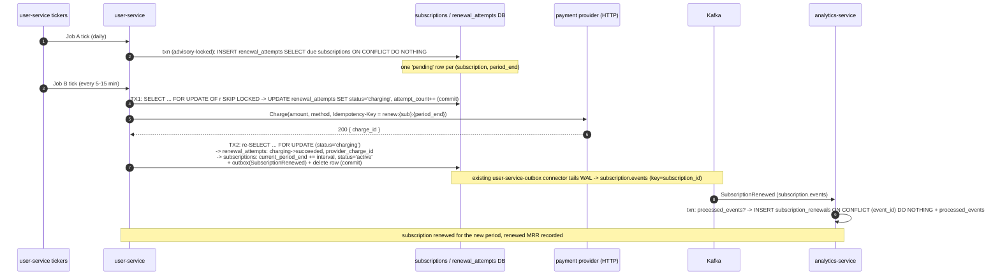

# Saga: renewal-subscriptions

> Status: **design only** — no code wired yet. This file is the contract that
> `saga-consistency-reviewer` and `e2e-saga-tester` check the implementation
> against. Wire it with the runs in [§11](#11-next-actions), each a separate
> reviewable step.

> **Read this first — it is not a seat-reservation-shaped saga, and it adds no new
> service.** Subscription renewal is a **feature of `user-service`** (Rust/axum).
> `user-service` owns every mutable row (`subscriptions`, `renewal_attempts`),
> runs the scheduled jobs, calls the payment provider and the email sender as
> outbound dependencies, and publishes outbound events through the outbox it
> **already has**. The only other service involved is `analytics-service`, which
> consumes those events into read models and never calls back. There is **no
> `subscription-service`, no `email-service`, no new Debezium connector, no
> Postgres/compose change** — see [§9](#9-infra-delta).
>
> This is a **single-writer process manager**: exactly one service writes state,
> so there is no distributed-commit problem and nothing to compensate across
> services. "Compensation" here means the *internal* dunning sequence and the
> `active → past_due → canceled` transitions, plus the reaper — all inside
> `user-service`. The repo's outbox/CDC/`processed_events`/DLQ machinery still
> applies to the publish side and to `analytics-service` as a consumer. See
> [§10](#10-choreography-sanity-check).

## 1. Summary

There is **no client-initiated action** that starts this flow. It is driven by
scheduled jobs inside **user-service** (Rust/axum, port 8081 — `kong/kong.yml`
`user-service`). The HTTP surface (`/api/v1/subscriptions`, new route on the
existing `user-service` Kong service, JWT required) is CRUD + a manual
"retry now"; it never charges inline.

- **Job A — enqueue due renewals** (daily, ~02:00 UTC). For every `active`
  subscription whose `current_period_end <= CURRENT_DATE`, materialize exactly one
  `renewal_attempts` row for that `(subscription_id, period_end)`. Idempotent via
  `UNIQUE (subscription_id, period_end)` + `ON CONFLICT DO NOTHING`; a second run
  the same day inserts nothing. Wrapped in `pg_try_advisory_lock` so two replicas
  cannot both sweep.
- **Job B — process attempts** (every 5–15 min). Claims a batch of due attempts
  (`status IN ('pending','failed_retryable','failed_permanent') AND
  next_attempt_at <= now()`) with `FOR UPDATE SKIP LOCKED`, and per row runs the
  **ProcessRenewalAttempt** flow: a short transaction marks the row `charging` and
  increments `attempt_count`; then — *outside any transaction* — it calls the
  payment provider with `Idempotency-Key = renew:{subscription_id}:{period_end}`;
  then a second transaction records the outcome:
  - **charge succeeded** → `renewal_attempts.status='succeeded'`,
    `subscriptions.current_period_end += 1 interval`,
    `subscriptions.status='active'`, write+delete `outbox_events`
    (`SubscriptionRenewed`).
  - **transient failure** (provider 5xx / timeout / 429) →
    `status='failed_retryable'`, `next_attempt_at = now() + backoff(attempt_count)`,
    capped at `RENEWAL_MAX_TRANSIENT_ATTEMPTS`, then `given_up` +
    `subscriptions.status='past_due'` + alert (the provider is down, not the card —
    no customer-facing event).
  - **permanent decline** (`card_declined` / `expired_card` /
    `insufficient_funds`) → `status='failed_permanent'`,
    `subscriptions.status='past_due'`, `dunning_attempt_count = 1`,
    `next_attempt_at` set to the first dunning slot, write+delete `outbox_events`
    (`SubscriptionPaymentFailed`). After TX2 commits, Job B calls
    `EmailGateway.Send` (dunning email, best-effort). Subsequent Job B passes walk
    the dunning schedule; on the last slot still declined →
    `subscriptions.status='canceled'`, write+delete `outbox_events`
    (`SubscriptionCanceled`).
- **Reaper** (every ~5 min) — resets rows wedged in `charging` past
  `RENEWAL_CHARGING_TIMEOUT` back to `failed_retryable, next_attempt_at=now()`
  (safe: the provider idempotency key makes the re-charge a no-op), and exposes
  Job A / Job B health gauges.
- **Reconciliation** (daily) — pulls the provider's charges for the last 48h and
  matches on `provider_charge_id`; a provider charge with no `succeeded` row is
  repaired, a `succeeded` row with no provider charge is alerted.

**analytics-service** (existing, Go) consumes `SubscriptionRenewed` and
`SubscriptionCanceled` (and, optionally, `SubscriptionPaymentFailed`) into read
models for renewed-MRR and involuntary-churn reporting. It never calls back into
`user-service`.

End states, per `(subscription, period)`:

| `renewal_attempts.status` | `subscriptions.status` | meaning |
|---|---|---|
| `succeeded` | `active`, `current_period_end` advanced | renewed, `SubscriptionRenewed` emitted |
| `given_up` | `past_due` | provider outage, transient retries exhausted — ops re-drives, no customer event |
| `failed_permanent` (dunning running) | `past_due` | one or more `SubscriptionPaymentFailed` emitted, customer being emailed |
| `failed_permanent` (dunning exhausted) | `canceled` | `SubscriptionCanceled` emitted |

Every event is partitioned by `subscription_id` end to end, so a Kafka partition
preserves per-subscription ordering (`SubscriptionPaymentFailed` … then
`SubscriptionRenewed` on recovery, or … `SubscriptionCanceled` on exhaustion).

## 2. Participants and ordered steps

The "initiator" role is a set of scheduled jobs inside `user-service`, not an
`http:` edge. Steps 1–2 are `user-service`'s jobs; 3a/3b/3c are the mutually
exclusive arms of the provider outcome; 4 is a best-effort outbound email; 5a/5b
are the `analytics-service` fan-out.

| # | Service | Role | Local transaction(s) — the use case owns every `Begin`/`Commit` | Emits |
|---|---|---|---|---|
| 1 | **user-service** | **Job A — enqueue** (scheduled, advisory-locked) | one read-write txn: `INSERT INTO renewal_attempts (…) SELECT s.id, s.current_period_end, 'renew:'||s.id||':'||s.current_period_end, 'pending', now() FROM subscriptions s WHERE s.status='active' AND s.current_period_end <= CURRENT_DATE ON CONFLICT (subscription_id, period_end) DO NOTHING` | — |
| 2 | **user-service** | **Job B — mark charging** (scheduled) | **TX1**: `SELECT … FROM renewal_attempts r JOIN subscriptions s ON s.id = r.subscription_id WHERE r.status IN ('pending','failed_retryable','failed_permanent') AND r.next_attempt_at <= now() AND s.status='active' ORDER BY r.next_attempt_at FOR UPDATE OF r SKIP LOCKED LIMIT $BATCH` → per row `UPDATE renewal_attempts SET status='charging', attempt_count = attempt_count + 1, updated_at = now()` → **commit** | — |
| — | *(no txn)* | **Job B — provider call** | `PaymentGateway.Charge(amount_minor, currency, payment_method_id, idempotency_key = 'renew:'||subscription_id||':'||period_end)` — outbound HTTP, wrapped per `/add-resilience` (timeout + capped retry + circuit breaker + bulkhead), **fail-closed**. No DB connection held. | — |
| 3a | **user-service** | **Job B — success** | **TX2**: re-`SELECT … FOR UPDATE` the row → if `status='charging'`: `UPDATE renewal_attempts SET status='succeeded', provider_charge_id=$id, last_error=NULL` + `UPDATE subscriptions SET current_period_end = current_period_end + interval, status='active', updated_at=now()` + write/delete `outbox_events` (`SubscriptionRenewed`) → **commit** | `SubscriptionRenewed` |
| 3b | **user-service** | **Job B — transient give-up** | **TX2**: if `attempt_count < RENEWAL_MAX_TRANSIENT_ATTEMPTS`: `UPDATE renewal_attempts SET status='failed_retryable', next_attempt_at = now() + backoff(attempt_count), last_error=$err`; else: `UPDATE renewal_attempts SET status='given_up', last_error=$err` + `UPDATE subscriptions SET status='past_due'` → **commit**. **No outbox row** on this arm. | — (alert only) |
| 3c | **user-service** | **Job B — permanent decline / dunning** | **TX2**: if `dunning_attempt_count < len(DUNNING_SCHEDULE)`: `UPDATE renewal_attempts SET status='failed_permanent', dunning_attempt_count = dunning_attempt_count + 1, next_attempt_at = period_end_anchor + DUNNING_SCHEDULE[n], last_error=$code` + `UPDATE subscriptions SET status='past_due'` + write/delete `outbox_events` (`SubscriptionPaymentFailed`); else (schedule exhausted): keep `status='failed_permanent'` + `UPDATE subscriptions SET status='canceled'` + write/delete `outbox_events` (`SubscriptionCanceled`) → **commit** | `SubscriptionPaymentFailed` **or** `SubscriptionCanceled` |
| 4 | **user-service** | **Job B — dunning email** (after 3c commits, *no txn*) | `sent_emails` unique-insert (own short txn) → `EmailGateway.Send(dunning_template, user_id, …)` — outbound, `/add-resilience`, **best-effort**. Failure is logged; the next dunning pass emits a fresh `SubscriptionPaymentFailed` and re-sends. | — (terminal) |
| 5a | **analytics-service** | reactor (`consume:SubscriptionRenewed`) — read model | `processed_events` check (keyed by `event_id`) → `INSERT INTO subscription_renewals (…) ON CONFLICT (event_id) DO NOTHING` | — (terminal) |
| 5b | **analytics-service** | reactor (`consume:SubscriptionCanceled`) — read model | `processed_events` check → `INSERT INTO subscription_cancellations (…) ON CONFLICT (event_id) DO NOTHING` | — (terminal) |

**Why two transactions in Job B, not one.** CLAUDE.md requires all non-DB work to
happen *before* `Begin` so a pooled connection is never pinned across
network/CPU-bound work. The provider `Charge` call is a multi-second outbound
HTTP request; it cannot sit inside a transaction. The use case therefore owns
**two** transactions bracketing the call — TX1 (mark `charging`, so a crash
mid-charge is *visible* to the reaper) and TX2 (record the committed outcome) —
each opened, threaded through every repo method, and committed by the use case.
Step 4's `sent_emails` insert is a third, tiny transaction; the email send itself
holds no connection.

## 3. Event catalog

Topic is always `<aggregate_type>.events`; its DLQ is `<aggregate_type>.events.dlq`.
`user-service` already runs the `user-service-outbox` Debezium connector on
`public.outbox_events` with `route.by.field=aggregate_type` and
`route.topic.replacement=${routedByValue}.events`, so a new
`aggregate_type = "subscription"` routes to **`subscription.events`
automatically** — no connector change (see [§9](#9-infra-delta)). Partition key is
the `aggregate_id` — the `subscription_id` for every event here. `event_id` is the
saga event's own UUID (= `outbox_events.id`) and is the idempotency key. Money is
integer minor units.

| Event | `aggregate_type` | Topic | Partition key | Producer | Consumer group(s) | Delivery guarantee | Payload fields |
|---|---|---|---|---|---|---|---|
| `SubscriptionRenewed` | `subscription` | `subscription.events` | `subscription_id` | user-service (outbox/CDC) | `analytics-service-SubscriptionRenewed` | **effectively-once** — the consumer inserts a `subscription_renewals` read-model row under `UNIQUE(event_id)`; a duplicate would double-count renewed MRR, a loss under-counts. at-least-once + `processed_events` dedupe on `event_id` = exactly-once processing. | `event_id` uuid, `subscription_id` uuid, `user_id` uuid, `plan_id` string, `renewal_attempt_id` uuid, `period_start` string(date), `new_period_end` string(date), `amount_minor` int, `currency` string(ISO 4217), `provider_charge_id` string, `attempt_count` int, `renewed_at` string(RFC3339) |
| `SubscriptionPaymentFailed` | `subscription` | `subscription.events` | `subscription_id` | user-service (outbox/CDC) | `analytics-service-SubscriptionPaymentFailed` *(optional — involuntary-churn funnel)* | **effectively-once** — a duplicate double-counts a failed attempt in the funnel, a loss under-counts. Dedupe on `event_id`. (The customer email is **not** driven by this event — see [§2](#2-participants-and-ordered-steps) step 4.) | `event_id` uuid, `subscription_id` uuid, `user_id` uuid, `plan_id` string, `renewal_attempt_id` uuid, `period_end` string(date), `amount_minor` int, `currency` string, `decline_code` string (`card_declined`\|`expired_card`\|`insufficient_funds`\|`other`), `dunning_attempt` int (1-based), `dunning_max` int, `next_attempt_at` string(RFC3339), `failed_at` string(RFC3339) |
| `SubscriptionCanceled` | `subscription` | `subscription.events` | `subscription_id` | user-service (outbox/CDC) | `analytics-service-SubscriptionCanceled` | **effectively-once** — analytics inserts a `subscription_cancellations` row under `UNIQUE(event_id)`; a duplicate double-counts involuntary churn, a loss under-counts. Dedupe on `event_id`. | `event_id` uuid, `subscription_id` uuid, `user_id` uuid, `plan_id` string, `renewal_attempt_id` uuid, `period_end` string(date), `reason` string (`dunning_exhausted`), `dunning_attempts` int, `canceled_at` string(RFC3339) |

**No at-most-once event.** Every event above carries state and travels through the
transactional outbox. The dunning email (step 4) is deliberately **not** an event
— it is a direct best-effort `EmailGateway` call from Job B, superseded by the
next dunning pass if it fails; making it a Kafka hop would require the
email-service that this revision explicitly drops.

**No event drives a change back into `user-service`.** All three are *outbound*,
consumed by `analytics-service` only.

**One topic, three event types.** `subscription.events` carries all three. Each
`analytics-service` consumer group guards on the `event_type` header and
**acks-and-skips** the types it does not own (exactly as `analytics-service`
already does across `user.events`); only poison of its *own* type, permanent
domain rejections, and retry-exhausted messages go to `subscription.events.dlq`.

## 4. Happy path



Terminal: `renewal_attempts.status='succeeded'` (`provider_charge_id` set),
`subscriptions.status='active'` with `current_period_end` advanced one interval,
one `subscription_renewals` read-model row.

## 5. Failure sequences

### 5.1 Provider returns a transient error (5xx / timeout / 429 / `processing_error`)

- **Fails at:** the provider call between TX1 and TX2 (step 2 → 3b). The
  `/add-resilience` wrapper's in-call retries are already exhausted, or the
  circuit breaker is open.
- **Handling (TX2, arm 3b):** if `attempt_count < RENEWAL_MAX_TRANSIENT_ATTEMPTS`
  (default 3) → `status='failed_retryable'`,
  `next_attempt_at = now() + backoff(attempt_count)` where
  `backoff = min(RENEWAL_BASE_BACKOFF * 2^(attempt_count-1), RENEWAL_MAX_BACKOFF)`
  + jitter (defaults `6h` base, `48h` cap). The next Job B tick after
  `next_attempt_at` re-picks the row. **No event, no `subscriptions` change** —
  the card is fine, the provider is not.
- **Retries exhausted:** `status='given_up'`, `subscriptions.status='past_due'`,
  `last_error` set, `renewal_given_up_total` counter + page. **No customer-facing
  event** — this is an ops problem, not a dunning situation. An operator re-drives
  once the provider is healthy by resetting the row to
  `failed_retryable, next_attempt_at=now()` (or via
  `POST /api/v1/subscriptions/{id}/retry-renewal`, [§7](#7-stuck-saga-policy)).
- **Compensation:** none — nothing downstream ran, no upstream step to undo.
- **Terminal state:** `renewal_attempts.status='given_up'`,
  `subscriptions.status='past_due'`.

### 5.2 Provider returns a permanent decline (`card_declined` / `expired_card` / `insufficient_funds`)

- **Fails at:** the provider call (step 2 → 3c). The decline code maps to the
  *permanent* bucket (same transient-vs-permanent split as `isRetryable` in the
  Kafka consumers, keyed on decline codes instead of SQLSTATE).
- **Handling (TX2, arm 3c), first occurrence:** `status='failed_permanent'`,
  `dunning_attempt_count = 1`, `next_attempt_at = period_end + DUNNING_SCHEDULE[0]`,
  `subscriptions.status='past_due'`, write/delete `outbox_events`
  (`SubscriptionPaymentFailed`, `dunning_attempt=1`). After commit, step 4 sends
  the "update your card" email (best-effort; `sent_emails` unique-insert dedupes).
- **Subsequent Job B passes** (row picked because `failed_permanent` is in the
  claim `WHERE` and `next_attempt_at <= now()`):
  - card now works → arm 3a: `status='succeeded'`,
    `subscriptions.status='active'`, `current_period_end` advanced,
    `SubscriptionRenewed` emitted. Dunning ends.
  - still declined and `dunning_attempt_count < len(DUNNING_SCHEDULE)` (default
    `[1d, 3d, 5d, 7d]`) → advance `dunning_attempt_count`, set next
    `next_attempt_at`, emit another `SubscriptionPaymentFailed`
    (`dunning_attempt = n`), send the next dunning email.
  - still declined and schedule exhausted → keep `status='failed_permanent'`,
    `subscriptions.status='canceled'`, emit `SubscriptionCanceled`
    (`reason='dunning_exhausted'`).
- **Compensation:** the dunning sequence itself **is** the compensation — a
  forward correction driving the subscription to a consistent terminal state
  (`active` on recovery, `canceled` on exhaustion).
- **If a dunning-arm TX2 or its outbox write transiently fails:** the row stays
  `charging` (TX2 never committed) and is recovered by the reaper (5.4); the same
  arm re-runs next pass. No duplicate email — the `SubscriptionPaymentFailed` for
  `dunning_attempt=n` is only produced by a committed TX2, and step 4's
  `sent_emails` unique row guards the send.
- **Terminal state:** `subscriptions.status='active'` (recovered) **or**
  `'canceled'` with `renewal_attempts.status='failed_permanent'` and a
  `SubscriptionCanceled` event.

### 5.3 Job B crashes after TX1 (`charging`) but before calling the provider

- **State when stuck:** `renewal_attempts.status='charging'`, no provider call
  made, card **not** charged.
- **Resolution:** the reaper ([§7](#7-stuck-saga-policy)) finds the row
  `updated_at < now() - RENEWAL_CHARGING_TIMEOUT` and resets it to
  `status='failed_retryable', next_attempt_at=now()`. The next Job B tick charges
  it normally.

### 5.4 Job B crashes *after* the provider charged but before TX2 (money taken, period not extended)

- **State when stuck:** `renewal_attempts.status='charging'`, the card **is**
  charged, `provider_charge_id` not recorded, `current_period_end` not advanced,
  no event emitted. This is the dangerous one.
- **Resolution — this is what the provider `Idempotency-Key` buys:** the reaper
  resets the row to `failed_retryable, next_attempt_at=now()`. The next Job B tick
  calls `PaymentGateway.Charge` again **with the same
  `Idempotency-Key = renew:{subscription_id}:{period_end}`**; the provider returns
  the *original* successful charge instead of charging again. TX2 arm 3a then runs
  normally. Net effect: correct, just delayed by one reaper + one Job B interval.
- **You retry the call, never the charge.** Committing `charging` *before* the
  provider call (TX1) is what makes this state visible to the reaper at all.
- **Backstop:** daily reconciliation (5.8).
- **Terminal state:** `succeeded`, one charge, period advanced once.

### 5.5 Job B is not running at all (deploy wedged, crash loop, ticker dead)

- **State:** `pending` / `failed_retryable` / `failed_permanent` rows accumulate
  with `next_attempt_at` in the past; nothing charges.
- **Detection:** the reaper (a separate ticker) exposes
  `renewal_oldest_due_attempt_age_seconds =
  now() - min(next_attempt_at) WHERE status IN
  ('pending','failed_retryable','failed_permanent') AND next_attempt_at <= now()`
  and `renewal_job_b_last_run_timestamp`. **Alert** when Job B is silent
  `> 2 ×` its interval, or the oldest-due age exceeds a threshold.
- **Resolution:** operational — fix the deploy. No data lost; Job B drains the
  backlog on return (`FOR UPDATE SKIP LOCKED` + `next_attempt_at` ordering).

### 5.6 Job A crashes mid-sweep (some due subscriptions have no `renewal_attempts` row)

- **State:** `active` subscriptions with `current_period_end <= CURRENT_DATE` and
  **no** `renewal_attempts` row for that `period_end` — never charged.
- **Detection:** the reaper exposes
  `renewal_due_not_enqueued_total = SELECT count(*) FROM subscriptions s WHERE
  s.status='active' AND s.current_period_end <= CURRENT_DATE AND NOT EXISTS
  (SELECT 1 FROM renewal_attempts r WHERE r.subscription_id = s.id AND
  r.period_end = s.current_period_end)`. **Alert** when `> 0` past one Job A
  interval.
- **Resolution:** re-run Job A — idempotent (`ON CONFLICT DO NOTHING`), fills only
  the gaps. Safe on demand.

### 5.7 Debezium / Kafka Connect is down when TX2 committed a `SubscriptionRenewed` / `SubscriptionPaymentFailed` / `SubscriptionCanceled`

- **State:** the `outbox_events` row was written **and deleted** in TX2 (the
  existing `user-service-outbox` connector is `skipped.operations=u,d,t` — inserts
  only; the WAL still carries the insert). The event has not reached
  `analytics-service` yet.
- **Resolution:** standard transactional-outbox property — Debezium resumes from
  its replication slot on restart and re-emits every un-acked insert. A connector
  restart can **re-emit** an already-published insert → `analytics-service`
  dedupes on `event_id` (`processed_events` + `ON CONFLICT (event_id)`).
- **No compensation** — nothing is inconsistent, only late.

### 5.8 Reconciliation mismatch (provider ledger vs local rows)

- **Daily job in user-service** pulls the provider's charge list for the last 48h
  and matches each on `provider_charge_id`.
  - **Provider charge with no matching `succeeded` `renewal_attempts` row** →
    money taken, subscription not extended. Find the row by the deterministic
    `idempotency_key` and re-run TX2 arm 3a (idempotent: re-`SELECT … FOR UPDATE`,
    check the row is not already `succeeded`, record `provider_charge_id`, advance
    the period, emit `SubscriptionRenewed`). Increment
    `renewal_reconciliation_repaired_total`.
  - **`succeeded` row whose `provider_charge_id` is absent from the provider
    ledger** → data bug. **Alert**, do **not** auto-mutate. Increment
    `renewal_reconciliation_mismatch_total`.

### 5.9 Dunning email (step 4) fails to send

- `EmailGateway.Send` errors (provider down, timeout) after TX2 already committed
  the dunning advance. **The customer was not told about *this* attempt.** No
  retry loop is run inline. The next Job B dunning pass (1–2 days later) emits a
  fresh `SubscriptionPaymentFailed` and calls `EmailGateway.Send` again — so the
  customer is still reached before cancellation, just one slot later. The
  `sent_emails` row is only written on a successful send, so the retry is not
  suppressed. `renewal_dunning_email_failed_total` counter + warn log; alert if it
  trends non-zero (the email provider is down).

### 5.10 Poison message / consumer failure on `subscription.events` (analytics-service)

- An `analytics-service` consumer that cannot deserialize a message of *its own*
  `event_type` publishes it to `subscription.events.dlq` with `x-dlq-reason`,
  `x-dlq-source-topic`, `x-dlq-source-partition`, `x-dlq-source-offset` headers,
  then commits the offset — the partition is never wedged. A message of another
  group's `event_type` is acked-and-skipped, not dead-lettered.
- Transient failure (DB blip) → do not commit, retry in-process with capped
  jittered backoff to `KAFKA_CONSUMER_MAX_ATTEMPTS`; exhausted →
  `subscription.events.dlq` + commit + alert. A missed read-model row is a metrics
  gap, not a billing error.

## 6. Compensation map

No cross-service compensations — one service writes state. Every row is a forward
correction *inside* `user-service` (or "none, because terminal / pure
projection").

| Forward step | Committed change | Failure trigger | Compensating / corrective step | Owner | Terminal state |
|---|---|---|---|---|---|
| 1. Job A enqueue | `renewal_attempts` row `status='pending'` | Job A crash → gap; **or** subscription canceled before Job B picks it | re-run Job A (idempotent); Job B's claim `JOIN subscriptions … WHERE s.status='active'` skips a row whose subscription is no longer active | user-service | stray `pending` row inert; gap refilled |
| 2. Job B mark `charging` (TX1) | `status='charging'`, `attempt_count++` | Job B crash before **or** after the provider call | **reaper**: `charging` older than `RENEWAL_CHARGING_TIMEOUT` → `failed_retryable, next_attempt_at=now()`; provider `Idempotency-Key` makes the re-charge a no-op (§5.3, §5.4) | user-service | row re-processed next Job B tick |
| 3a. Job B success (TX2) | `status='succeeded'` + `current_period_end += interval`, `status='active'` + `SubscriptionRenewed` | *none* — success terminal. A refund would be a **new** flow, never a rollback of this one. | n/a | — | `succeeded` / `active` |
| 3b. Job B transient give-up (TX2) | `status='given_up'` + `subscriptions.status='past_due'` | *none* — terminal handling of a provider outage; ops re-drives by resetting to `failed_retryable`. | (manual / retry endpoint) | user-service | `given_up` / `past_due` until re-driven |
| 3c. Job B dunning (TX2) | `status='failed_permanent'`, `dunning_attempt_count++` + `past_due` + `SubscriptionPaymentFailed` | dunning schedule exhausted, still declined | keep `failed_permanent`, `subscriptions.status='canceled'`, emit `SubscriptionCanceled` — a forward transition | user-service | `canceled` |
| 4. Job B dunning email | `sent_emails` row + provider email sent | send error | *none inline* — next dunning pass re-emits `SubscriptionPaymentFailed` + re-sends (§5.9); `sent_emails` only written on success | user-service | email sent, or retried next pass |
| 5a/5b. analytics projections | `subscription_renewals` / `subscription_cancellations` row | *none* — pure projection, idempotent under `UNIQUE(event_id)`, no downstream | n/a | — | read-model row present |

## 7. Stuck-saga policy

There is no coordinator; `user-service` runs its own reaper on its own DB. Because
it is the only writer, this reaper is the *entire* stuck-saga story.

### user-service — reaper (single ticker, several duties)

Runs on `RENEWAL_REAPER_INTERVAL` (default `5m`), advisory-locked so only one
replica acts. Precedent: the booking-service reaper is likewise a `tokio::spawn`ed
ticker (see `seat-reservation.md` §7).

1. **Stuck `charging`** — the only row state that can wedge:

   ```sql
   SELECT id, subscription_id, period_end
   FROM renewal_attempts
   WHERE status = 'charging'
     AND updated_at < now() - make_interval(secs => $1)   -- $1 = RENEWAL_CHARGING_TIMEOUT, default 900
   ORDER BY updated_at
   FOR UPDATE SKIP LOCKED
   LIMIT 100;
   ```

   per row, one txn: `UPDATE renewal_attempts SET status='failed_retryable',
   next_attempt_at = now(), last_error = 'charging_timeout_reaped', updated_at =
   now()`. Log at **WARN**, increment `renewal_charging_reaped_total`. Safe because
   `FOR UPDATE SKIP LOCKED` skips a row a Job B worker is still finishing TX2 on,
   and the provider `Idempotency-Key` makes the re-issued charge a no-op.

2. **Job B health** — `renewal_oldest_due_attempt_age_seconds` +
   `renewal_job_b_last_run_timestamp` gauges (§5.5).

3. **Job A health** — `renewal_due_not_enqueued_total` gauge (§5.6).

**Maximum wall-clock in a non-terminal state:**

| State | Cap | Then |
|---|---|---|
| `charging` | `RENEWAL_CHARGING_TIMEOUT` (default `15m`) | reaper → `failed_retryable, next_attempt_at=now()` |
| `failed_retryable` | `RENEWAL_MAX_TRANSIENT_ATTEMPTS` attempts (default 3), ≈ 3 days of backoff | `given_up` + `past_due` + page |
| `failed_permanent` (dunning) | `len(DUNNING_SCHEDULE)` slots (default `[1d,3d,5d,7d]` → 7 days) | `subscriptions.status='canceled'` + `SubscriptionCanceled` |
| `pending` | one Job B interval | reaper's Job-B-health alert if not picked |

### What a client sees

Renewal is entirely asynchronous — no request blocks on it.

- `GET /api/v1/subscriptions/{id}` (JWT, owner-scoped by `sub` = `user_id`) →
  `{ id, plan_id, status ('active'|'past_due'|'canceled'|'paused'),
  current_period_end, latest_renewal: { status, attempt_count, dunning_attempt,
  next_attempt_at, last_error } }`.
- `POST /api/v1/subscriptions/{id}/retry-renewal` (JWT, owner-scoped) → **`202
  Accepted`**; sets the current-period `renewal_attempts` row to
  `status='failed_retryable', next_attempt_at=now()` (or inserts it if Job A
  hasn't run), so the next Job B tick picks it up. Never charges inline.

## 8. Idempotency and DLQ requirements

**Producer-side idempotency (`user-service` — not a Kafka consumer for this flow,
so no `processed_events` on the write path):**

| Layer | Guarantees |
|---|---|
| `renewal_attempts` `UNIQUE (subscription_id, period_end)` + Job A `ON CONFLICT DO NOTHING` | Job A can never create a second attempt for a period; re-running the job is a no-op. |
| `status` guard in Job B's claim `WHERE` + `FOR UPDATE OF r SKIP LOCKED` | Two Job B workers/replicas cannot process the same row; a row already `succeeded`/`given_up` is not re-claimed. TX2 re-checks `status='charging'` before mutating. |
| Provider `Idempotency-Key = renew:{subscription_id}:{period_end}` | A retried `Charge` call (crash between TX1 and TX2, or a reaper reset) returns the original charge instead of charging again. |
| `sent_emails` `UNIQUE (event_id)` | A dunning email is sent at most once per `SubscriptionPaymentFailed` even if Job B is re-run. |
| Reconciliation on `provider_charge_id` (§5.8) | Daily catch-all for anything the loops above missed. |

**Consumer-side idempotency (`analytics-service`):** follows the repo engine
contract (`internal/adapter/messaging/kafka/consumer.go` is the reference):
`FetchMessage` → handle → commit the offset only after the side-effect txn
commits; `event_type`-header guard for ack-and-skip;
`retryable = errors.As(&domain.RepositoryError)`; capped jittered backoff to
`KAFKA_CONSUMER_MAX_ATTEMPTS` (default 5); DLQ writer to `subscription.events.dlq`
with `x-dlq-*` headers.

| Consumer group | Topic | Owns `event_type` | `processed_events` check | DLQ classification |
|---|---|---|---|---|
| `analytics-service-SubscriptionRenewed` | `subscription.events` | `SubscriptionRenewed` | On the projection txn, before `INSERT subscription_renewals`, keyed by `event_id`. `UNIQUE(event_id)` is a second backstop. | success / dup → **commit**; transient → retry→backoff→`subscription.events.dlq`; poison → `subscription.events.dlq`; other types → **ack-and-skip**. |
| `analytics-service-SubscriptionCanceled` | `subscription.events` | `SubscriptionCanceled` | As above, into `subscription_cancellations`. | As above. |
| `analytics-service-SubscriptionPaymentFailed` *(optional)* | `subscription.events` | `SubscriptionPaymentFailed` | As above, into a `subscription_payment_failures` funnel table. | As above. |

> `analytics-service` needs two (or three) `subscription.events` `event_type`s.
> Each *could* run a single group switching on `event_type` instead of N
> ack-and-skip groups; the table follows the repo's one-group-per-event-type
> precedent. Collapsing is a valid local choice as long as a poison message of one
> type cannot wedge the others.

## 9. Infra delta

**No new service. No new Debezium connector. No Postgres / docker-compose change
to `user-service` or its database.** `postgres-user` already runs
`wal_level=logical` (the `user-service-outbox` connector depends on it), and that
connector already routes `public.outbox_events` by `aggregate_type`, so
`aggregate_type='subscription'` lands on `subscription.events` with zero connector
work.

### Kong — one new route on the existing `user-service`

`kong/kong.yml`, under the existing `user-service` service, add a route alongside
`auth-routes` / `user-profile-routes`:

```yaml
- name: subscription-routes
  paths:
    - /api/v1/subscriptions
  strip_path: false
  plugins:
    - name: rate-limiting
      config:
        minute: 300
        policy: local
    - name: jwt
      config:
        claims_to_verify:
          - exp
```

JWT verification reuses the existing `user-service-issuer` consumer (tokens are
minted by `user-service`, `iss=user-service`) — **no new `consumers:` entry**.
`api-contract-reviewer` should see this route resolve to `user-service:8081`.

### Topics — add to the `kafka-init` one-shot in `docker-compose.yml`

```
subscription.events        --partitions 3 --replication-factor 1
subscription.events.dlq    --partitions 1 --replication-factor 1
```

Parameterize like `user.events`: `KAFKA_SUBSCRIPTION_EVENTS_TOPIC` (default
`subscription.events`). Add `KAFKA_SUBSCRIPTION_EVENTS_TOPIC` to the
`analytics-service` container env (it already `depends_on` `kafka` /
`kafka-init`).

### Outbound-dependency resilience (`user-service`, Rust)

- **`PaymentGateway` domain port** — the provider `Charge` call. Wrap with
  `/add-resilience` (timeout + capped retry-with-jitter + circuit breaker +
  bulkhead). **Fail-closed:** a provider timeout / breaker-open is a *transient*
  renewal failure (arm 3b) — the period is **never** advanced on an unconfirmed
  charge. Every call carries `Idempotency-Key = renew:{subscription_id}:{period_end}`.
- **`EmailGateway` domain port** — the dunning email. Wrap with `/add-resilience`.
  Best-effort at the call site: a failure is logged and superseded by the next
  dunning pass (§5.9); `sent_emails` is written only on success.

Both are *pure* outbound-gateway ports (name no infra type), so per CLAUDE.md they
live in `domain` (`src/domain/ports.rs`, next to `PasswordHasher`).

### Migrations

**user-service** (Rust, `sqlx::migrate!`, `services/user-service/migrations/`).
**Reuse the existing `outbox_events` (`20260827000010` + `20260828000001`) and
`processed_events` (`20260904000001`) — no change.** New timestamped files:

- `…_create_subscriptions.sql` — `id UUID PK`, `user_id UUID NOT NULL` (= the
  `users.id` of the owner; owner-scoped queries filter on it), `plan_id TEXT NOT
  NULL` (opaque plan identifier — no separate `plans` table this revision),
  `status TEXT NOT NULL DEFAULT 'active' CHECK (status IN
  ('active','past_due','canceled','paused'))`, `current_period_end DATE NOT NULL`,
  `interval TEXT NOT NULL CHECK (interval IN ('month','year'))`, `price_minor
  BIGINT NOT NULL CHECK (price_minor >= 0)`, `currency TEXT NOT NULL`,
  `payment_method_id TEXT NOT NULL`, `created_at` / `updated_at TIMESTAMPTZ NOT
  NULL DEFAULT now()`. Indexes: `subscriptions_due_idx (status,
  current_period_end)` (Job A sweep), `subscriptions_user_id_created_at_id_idx
  (user_id, created_at DESC, id DESC)` (owner-scoped list).
- `…_create_renewal_attempts.sql` — `id UUID PK`, `subscription_id UUID NOT NULL
  REFERENCES subscriptions(id)`, `period_end DATE NOT NULL`, `idempotency_key TEXT
  NOT NULL`, `status TEXT NOT NULL DEFAULT 'pending' CHECK (status IN
  ('pending','charging','succeeded','failed_retryable','failed_permanent','given_up'))`,
  `attempt_count INT NOT NULL DEFAULT 0`, `dunning_attempt_count INT NOT NULL
  DEFAULT 0`, `next_attempt_at TIMESTAMPTZ NOT NULL DEFAULT now()`,
  `provider_charge_id TEXT`, `last_error TEXT`, `created_at` / `updated_at
  TIMESTAMPTZ NOT NULL DEFAULT now()`. Constraints/indexes: **`UNIQUE
  (subscription_id, period_end)`**, `UNIQUE (idempotency_key)`,
  `renewal_attempts_due_idx (status, next_attempt_at)` (Job B claim),
  `renewal_attempts_charging_idx (status, updated_at) WHERE status = 'charging'`
  (reaper), `renewal_attempts_subscription_id_idx` (FK).
- `…_create_sent_emails.sql` — `id UUID PK`, `event_id UUID NOT NULL UNIQUE`,
  `user_id UUID NOT NULL`, `template TEXT NOT NULL`, `provider_message_id TEXT`,
  `sent_at TIMESTAMPTZ NOT NULL DEFAULT now()`.

`dunning_attempt_count` is an addition to the sketch in the prompt — it makes the
dunning position durable across Job B passes.

**analytics-service** (Go embedded runner):

- `…_create_subscription_renewals.sql` — `event_id UUID PRIMARY KEY,
  subscription_id UUID NOT NULL, user_id UUID NOT NULL, plan_id TEXT NOT NULL,
  amount_minor BIGINT NOT NULL, currency TEXT NOT NULL, new_period_end DATE NOT
  NULL, attempt_count INT NOT NULL, renewed_at TIMESTAMPTZ NOT NULL`. Index
  `(renewed_at)`.
- `…_create_subscription_cancellations.sql` — `event_id UUID PRIMARY KEY,
  subscription_id UUID NOT NULL, user_id UUID NOT NULL, plan_id TEXT NOT NULL,
  reason TEXT NOT NULL, dunning_attempts INT NOT NULL, canceled_at TIMESTAMPTZ NOT
  NULL`. Index `(canceled_at)`.
- *(optional)* `…_create_subscription_payment_failures.sql` — `event_id UUID
  PRIMARY KEY, subscription_id UUID NOT NULL, decline_code TEXT NOT NULL,
  dunning_attempt INT NOT NULL, failed_at TIMESTAMPTZ NOT NULL`.
- `processed_events` — **already exists** (`20260827000003`), reused for the new
  groups.

### Scheduled jobs — in-process Tokio tickers in `user-service`

Started from `main.rs`, stopped on graceful shutdown — mirrors the booking-service
reaper pattern (`tokio::spawn` + `tokio::time::interval`).

| Job | Interval (env) | Concurrency safety |
|---|---|---|
| Job A — enqueue | `RENEWAL_ENQUEUE_INTERVAL`, default `24h` (align ~02:00 UTC) | `SELECT pg_try_advisory_lock(hashtext('renewal-enqueue'))` on a dedicated conn — one replica sweeps |
| Job B — process | `RENEWAL_PROCESS_INTERVAL`, default `10m` | **no advisory lock** — every replica runs it; `FOR UPDATE OF r SKIP LOCKED` on the claim is the safety + throughput mechanism |
| Reaper | `RENEWAL_REAPER_INTERVAL`, default `5m` | `pg_try_advisory_lock(hashtext('renewal-reaper'))` |
| Reconciliation | `RENEWAL_RECONCILE_INTERVAL`, default `24h` | `pg_try_advisory_lock(hashtext('renewal-reconcile'))` |

Env knobs: `RENEWAL_MAX_TRANSIENT_ATTEMPTS` (3), `RENEWAL_BASE_BACKOFF` (`6h`),
`RENEWAL_MAX_BACKOFF` (`48h`), `RENEWAL_CHARGING_TIMEOUT` (`15m`),
`RENEWAL_DUNNING_SCHEDULE` (`1d,3d,5d,7d`), `RENEWAL_BATCH_SIZE` (`100`).

### Observability

- **Job B:** `renewal_attempts_processed_total{outcome}`, attempt rate, success
  ratio, `renewal_oldest_due_attempt_age_seconds`,
  `renewal_oldest_charging_age_seconds`, `renewal_job_b_last_run_timestamp`.
- **Reaper / Job A / email:** `renewal_charging_reaped_total`,
  `renewal_given_up_total`, `renewal_due_not_enqueued_total`,
  `renewal_reconciliation_repaired_total`, `renewal_reconciliation_mismatch_total`,
  `renewal_dunning_email_failed_total`.
- **Business (analytics-service):** renewal success rate, renewed MRR vs due MRR,
  involuntary-churn rate.
- **Alerts:** Job B silent `> 2 ×` interval; `renewal_given_up_total` rising;
  `renewal_due_not_enqueued_total > 0`; `renewal_reconciliation_mismatch_total >
  0`; `subscription.events.dlq` depth `> 0`.
- **Trace context:** if `/add-observability` has run on `user-service`, TX2 writes
  `traceparent` into `outbox_events.tracecontext`; the SMT maps it to the Kafka
  header; `analytics-service` continues the trace. (`user-service` is not yet
  retrofitted with the observability baseline — tracked separately.)

## 10. Choreography sanity check

**Hops:** request-driven = **0** (scheduled). Kafka hops = **1** — `user-service`
→ `analytics-service`, **no return path**.

**Conditional branches:** the 4-way branching (success / transient give-up /
permanent decline / dunning-exhausted) is **entirely local to `user-service`'s
state machine** — it never crosses a service boundary and no other service needs
to know it exists.

**Verdict: this is not a choreography saga — it is a feature of `user-service`,
and that is the right shape.** Choreography (and orchestration) exist to
coordinate a business transaction whose state changes span *multiple writers*.
Here there is exactly one writer, so there is no distributed-commit problem and
nothing to compensate across services. What remains is:

- a **local state machine** driven by scheduled jobs, with the two-transaction
  bracket around the provider call and the two idempotency layers (`UNIQUE
  (subscription_id, period_end)` + provider `Idempotency-Key`); and
- an **outbound event publication** through `user-service`'s existing outbox →
  existing connector → `subscription.events`, consumed by `analytics-service` as a
  pure read-model reactor.

An orchestrator or a dedicated service would add moving parts for a sequence that
lives correctly inside one existing service. **Recommendation: keep it as
designed.** `saga-consistency-reviewer` should check the *publish* side (new
`aggregate_type`, topic + DLQ present) and the `analytics-service` consumer groups
against this doc; the Job A/B/reaper/reconciliation logic is `/review-concurrency`
and `integration-test-writer` territory (contended `FOR UPDATE SKIP LOCKED` claim,
crash-between-TX1-and-TX2, duplicate provider call, dunning-schedule walk).

## 11. Next actions

> The renewal feature lives in **`user-service` (Rust)** → `/new-rust-api-endpoint`.
> `analytics-service` stays Go (`/new-go-api-endpoint`) and already runs the
> consumer engine + has `processed_events` — the new groups just join its
> `[]consumerRunner` slice.

Run in order. Run `/plan` before the `publish:` / `consume:` steps. Then
`saga-consistency-reviewer` after the batch and `e2e-saga-tester` once the stack
is up.

```
# --- Kong (edit by hand — one route on the EXISTING user-service, §9) -------------
#     add subscription-routes { /api/v1/subscriptions, rate-limit 300/min, jwt(exp) } to kong/kong.yml

# --- schema --------------------------------------------------------------------------
/new-migration        user-service        subscriptions            # status/interval/price_minor/currency/payment_method_id; due + owner-list indexes
/new-migration        user-service        renewal_attempts         # UNIQUE(subscription_id, period_end) + UNIQUE(idempotency_key) + due/charging indexes
/new-migration        user-service        sent_emails              # UNIQUE(event_id) dunning-email ledger
/new-migration        analytics-service   subscription_renewals
/new-migration        analytics-service   subscription_cancellations
# /new-migration      analytics-service   subscription_payment_failures   # optional involuntary-churn funnel

# --- outbound-dependency resilience (Rust, ports in src/domain/ports.rs) -----------
/add-resilience       user-service        PaymentGateway           # timeout + retry + breaker + bulkhead; FAIL-CLOSED; Idempotency-Key per call
/add-resilience       user-service        EmailGateway             # best-effort; lost mail superseded next dunning pass

# --- HTTP surface on user-service (Rust) ------------------------------------------
/new-rust-api-endpoint  user-service  CreateSubscription   http:POST:/api/v1/subscriptions
/new-rust-api-endpoint  user-service  GetSubscription      http:GET:/api/v1/subscriptions/{id}          # owner-scoped in SQL: WHERE id=$1 AND user_id=$sub -> NotFound on mismatch, no existence leak
/new-rust-api-endpoint  user-service  ListSubscriptions    http:GET:/api/v1/subscriptions               # paginated envelope, WHERE user_id=$sub, reuse existing domain::Pagination (src/domain/pagination.rs)
/new-rust-api-endpoint  user-service  RetryRenewalNow      http:POST:/api/v1/subscriptions/{id}/retry-renewal   # 202; sets renewal_attempts.next_attempt_at=now(); never charges inline

# --- the publish step (Rust) ---------------------------------------------------------
/new-rust-api-endpoint  user-service  ProcessRenewalAttempt \
      publish:SubscriptionRenewed:subscription \
      publish:SubscriptionPaymentFailed:subscription \
      publish:SubscriptionCanceled:subscription
      # the Job B TX2 arms. NO new connector (existing user-service-outbox routes aggregate_type='subscription'
      # to subscription.events); NO postgres-user change. Needs: subscription.events + .dlq in kafka-init.
      # The use case calls repo.write_outbox per event (usecase-owns-write), not a repo-side loop.

# --- downstream consumers (Go, analytics-service already has the engine) -----------
/new-go-api-endpoint  analytics-service  RecordSubscriptionRenewal \
      consume:SubscriptionRenewed:subscription.events        # add group analytics-service-SubscriptionRenewed to []consumerRunner; add KAFKA_SUBSCRIPTION_EVENTS_TOPIC (config + compose)
/new-go-api-endpoint  analytics-service  RecordSubscriptionCancellation \
      consume:SubscriptionCanceled:subscription.events       # add group analytics-service-SubscriptionCanceled (no new infra)
# /new-go-api-endpoint analytics-service RecordSubscriptionPaymentFailure \
#     consume:SubscriptionPaymentFailed:subscription.events  # optional funnel group
```

**Scheduled workers — added by hand in `user-service` (Rust Tokio tickers), not
`/new-rust-api-endpoint` output** (same as the seat-reservation reapers, per §7 /
§9):

```
user-service : EnqueueDueRenewalsUseCase   — Job A ticker, advisory-locked,
      INSERT ... SELECT ... ON CONFLICT (subscription_id, period_end) DO NOTHING.
      Env RENEWAL_ENQUEUE_INTERVAL (default 24h).
user-service : ProcessRenewalBatchUseCase  — Job B ticker (no advisory lock),
      claim FOR UPDATE OF r SKIP LOCKED -> TX1 (charging) -> PaymentGateway.Charge -> TX2 (3a/3b/3c)
      -> on 3c commit, EmailGateway.Send + sent_emails insert.
      Env RENEWAL_PROCESS_INTERVAL (10m), RENEWAL_BATCH_SIZE (100).
user-service : ReapChargingAttemptsUseCase — reaper ticker, advisory-locked,
      charging older than RENEWAL_CHARGING_TIMEOUT -> failed_retryable, next_attempt_at=now();
      + Job A / Job B health gauges. Env RENEWAL_REAPER_INTERVAL (5m).
user-service : ReconcileProviderChargesUseCase — daily ticker, advisory-locked,
      pull provider charges (last 48h), match on provider_charge_id, repair/alert (§5.8).
      Env RENEWAL_RECONCILE_INTERVAL (24h).
```

Consumer-scaffolding status: **`user-service`** does not consume anything for this
flow — it only publishes (via the outbox it already has), so it needs **no** Kafka
consumer engine. **`analytics-service`** already runs the engine on `user.events`
(and `booking.events` once seat-reservation lands) — the `subscription.events`
groups are added to the same `[]consumerRunner` slice plus
`KAFKA_SUBSCRIPTION_EVENTS_TOPIC` in config + compose.
