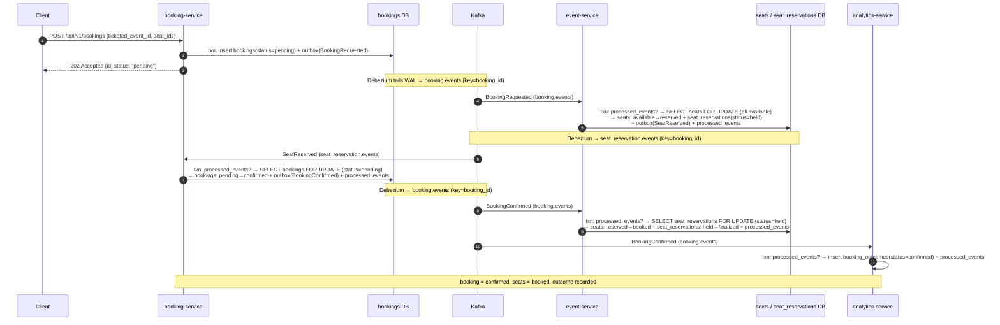

# Saga: seat-reservation

> Status: **design only** — no code wired yet. This file is the contract that
> `saga-consistency-reviewer` and `e2e-saga-tester` check the implementation
> against. Wire it with the `/new-go-api-endpoint` runs in [§11](#11-next-actions),
> each a separate reviewable step.

## 1. Summary

A signed-in client reserves specific seats for an event by calling
`POST /api/v1/bookings` on **booking-service** (Rust/axum, port 8083, JWT
required, 300 req/min — `kong/kong.yml` `booking-routes`). booking-service
creates a `booking`
row in `pending` and announces `BookingRequested`. **event-service** (Go, port
8082) reacts by row-locking the requested `seats` and moving them
`available → reserved`, then announces `SeatReserved` — or, if any seat is not
available / not found, `SeatReservationFailed`. booking-service reacts to that
outcome: `SeatReserved` drives the booking `pending → confirmed` and announces
`BookingConfirmed`; `SeatReservationFailed` drives the compensation
`pending → cancelled` and announces `BookingCancelled`. event-service then
finalizes its own earlier step — `BookingConfirmed` promotes the held seats
`reserved → booked` (terminal), `BookingCancelled` releases them
`reserved → available` (compensation). **analytics-service** (Go, port 8084)
consumes the two terminal booking events into the existing `booking_outcomes`
read model only. End states: booking `confirmed` (seats `booked`) or booking
`cancelled` (seats back to `available`, or never touched).

Every event in the saga is partitioned by `booking_id` end to end, so a Kafka
partition preserves per-booking ordering across every hop.

## 2. Participants and ordered steps

| # | Service | Role | Local transaction (one DB txn) | Emits |
|---|---|---|---|---|
| 1 | **booking-service** | **initiator** (`http:POST /api/v1/bookings`) | insert `bookings` (`status='pending'`, `seat_ids`, `failure_reason=NULL`) + write/delete `outbox_events` | `BookingRequested` |
| 2 | **event-service** | reactor (`consume:BookingRequested`) | `processed_events` check → `SELECT … FROM seats WHERE id = ANY($seat_ids) FOR UPDATE` → if all `available`: `UPDATE seats SET status='reserved'` + insert `seat_reservations` (`status='held'`) + write/delete `outbox_events`; else: write/delete `outbox_events` only | `SeatReserved` **or** `SeatReservationFailed` |
| 3a | **booking-service** | reactor (`consume:SeatReserved`) | `processed_events` check → `SELECT … FROM bookings WHERE id=$booking_id FOR UPDATE` → if `status='pending'`: `UPDATE bookings SET status='confirmed'` + write/delete `outbox_events` | `BookingConfirmed` |
| 3b | **booking-service** | reactor (`consume:SeatReservationFailed`) — **compensation** | `processed_events` check → `SELECT … bookings … FOR UPDATE` → if `status='pending'`: `UPDATE bookings SET status='cancelled', failure_reason=$reason` + write/delete `outbox_events` | `BookingCancelled` |
| 4a | **event-service** | reactor (`consume:BookingConfirmed`) — finalize | `processed_events` check → `SELECT … FROM seat_reservations WHERE booking_id=$booking_id FOR UPDATE` → if `status='held'`: `UPDATE seats SET status='booked' WHERE id = ANY($seat_ids)` + `UPDATE seat_reservations SET status='finalized'` | — (terminal) |
| 4b | **event-service** | reactor (`consume:BookingCancelled`) — **compensation** | `processed_events` check → `SELECT … seat_reservations … FOR UPDATE` → if `status='held'`: `UPDATE seats SET status='available'` + `UPDATE seat_reservations SET status='released'`; if no row: idempotent no-op | — (terminal) |
| 4c | **analytics-service** | reactor (`consume:BookingConfirmed` / `consume:BookingCancelled`) — read model | `processed_events` check → `INSERT INTO booking_outcomes (…, status)` (`status` = `confirmed`/`cancelled`) | — (terminal) |

Steps 3a/3b are the two arms of one decision; steps 4a/4b/4c are fan-out on the
terminal booking event and run independently.

## 3. Event catalog

Topic is always `<aggregate_type>.events`; its DLQ is `<aggregate_type>.events.dlq`.
Partition key is always the `aggregate_id` (the `booking_id` for every event in
this saga). Payload keys are snake_case and become the Kafka message value
verbatim; `event_id` is the saga event's own UUID (= the `outbox_events.id`
column) and is the idempotency key. `ticketed_event_id` is the `events.id` of the
event being booked (named distinctly so it never collides with the saga
`event_id`).

| Event | `aggregate_type` | Topic | Partition key | Producer | Consumer group(s) | Delivery guarantee | Payload fields |
|---|---|---|---|---|---|---|---|
| `BookingRequested` | `booking` | `booking.events` | `booking_id` | booking-service (outbox/CDC) | `event-service-BookingRequested` | **effectively-once** — the consumer performs a seat state transition (`available→reserved`) that is harmful if replayed, and a lost event strands the booking in `pending` until the reaper; at-least-once + `processed_events` dedupe on `event_id` = exactly-once processing. | `event_id` uuid, `booking_id` uuid, `user_id` uuid, `ticketed_event_id` uuid, `seat_ids` uuid[], `requested_at` string(RFC3339) |
| `SeatReserved` | `seat_reservation` | `seat_reservation.events` | `booking_id` | event-service (outbox/CDC) | `booking-service-SeatReserved` | **effectively-once** — drives `booking pending→confirmed` and re-emits `BookingConfirmed`; a duplicate would double-confirm / double-emit, a loss strands `pending`. Dedupe on `event_id`. | `event_id` uuid, `booking_id` uuid, `ticketed_event_id` uuid, `seat_ids` uuid[], `reserved_at` string(RFC3339) |
| `SeatReservationFailed` | `seat_reservation` | `seat_reservation.events` | `booking_id` | event-service (outbox/CDC) | `booking-service-SeatReservationFailed` | **effectively-once** — drives the `pending→cancelled` compensation; a duplicate would double-cancel / double-emit, a loss strands `pending`. Dedupe on `event_id`. | `event_id` uuid, `booking_id` uuid, `ticketed_event_id` uuid, `seat_ids` uuid[], `reason` string (`seat_unavailable`\|`seat_not_found`\|`event_not_found`), `failed_at` string(RFC3339) |
| `BookingConfirmed` | `booking` | `booking.events` | `booking_id` | booking-service (outbox/CDC) | `event-service-BookingConfirmed`, `analytics-service-BookingConfirmed` | **effectively-once** — event-service does `reserved→booked` (harmful if replayed); analytics inserts a `booking_outcomes` row under a `UNIQUE(booking_id)`. Both dedupe on `event_id`. | `event_id` uuid, `booking_id` uuid, `user_id` uuid, `ticketed_event_id` uuid, `seat_ids` uuid[], `occurred_at` string(RFC3339) |
| `BookingCancelled` | `booking` | `booking.events` | `booking_id` | booking-service (outbox/CDC) | `event-service-BookingCancelled`, `analytics-service-BookingCancelled` | **effectively-once** — event-service releases the held seats (`reserved→available`); analytics inserts a `booking_outcomes` row under `UNIQUE(booking_id)`. Both dedupe on `event_id`. | `event_id` uuid, `booking_id` uuid, `user_id` uuid, `ticketed_event_id` uuid, `seat_ids` uuid[], `reason` string (`seat_unavailable`\|`reservation_timeout`\|`confirm_failed`), `occurred_at` string(RFC3339) |

No event in this saga is at-most-once: every one carries state and travels
through the transactional outbox. If a best-effort "seats-selling-fast"
notification is wanted later, that is a direct Kafka producer call outside the DB
transaction, documented as lossy — not an `outbox_events` row and not part of
this saga.

**One topic, several event types.** `booking.events` carries `BookingRequested`,
`BookingConfirmed`, and `BookingCancelled`. Each consumer group guards on the
`event_type` header and **acks-and-skips** the types it does not own (as
`analytics-service` already does on `user.events`); only poison of its *own* type,
permanent domain rejections, and retry-exhausted messages go to
`booking.events.dlq`. `seat_reservation.events` carries `SeatReserved` and
`SeatReservationFailed` with the same rule.

> Implementation note: `event-service` needs all three `booking.events` types and
> `analytics-service` needs two, so each *could* run a single group that switches
> on `event_type` instead of N ack-and-skip groups. The table above follows the
> repo's established one-group-per-event-type precedent; collapsing is a valid
> local choice as long as a poison message of one type cannot wedge the others.

## 4. Happy path



Terminal: `bookings.status='confirmed'`, all `seat_ids` at `status='booked'`,
`seat_reservations.status='finalized'`, one `booking_outcomes` row with
`status='confirmed'`.

## 5. Failure sequences

### 5.1 A requested seat is unavailable (already `reserved`/`booked`, or wrong event)

- **Fails at:** step 2, event-service. The `SELECT … seats … FOR UPDATE` shows at
  least one seat not `available` (held/booked by another booking), or a
  `seat_id` does not exist, or a seat's `event_id` ≠ `ticketed_event_id`.
- **Emitted instead:** `SeatReservationFailed` with `reason` ∈
  `{seat_unavailable, seat_not_found, event_not_found}`. **No seat rows change**
  and **no `seat_reservations` row is written** — only the outbox row, plus
  `processed_events` for the incoming `BookingRequested`. The transaction still
  commits (this is a *permanent domain outcome*, not an error), so the offset is
  committed and the partition moves on.
- **Compensation:** `booking-service-SeatReservationFailed` consumes it and runs
  **CancelBooking** — `SELECT bookings FOR UPDATE`, and if `status='pending'`:
  `UPDATE bookings SET status='cancelled', failure_reason=$reason`, write
  `BookingCancelled` (`reason='seat_unavailable'`) to the outbox, insert
  `processed_events`, commit.
- **Downstream of the compensation:** `event-service-BookingCancelled` consumes
  `BookingCancelled`, finds **no `seat_reservations` row** for this booking, and
  acks as an idempotent no-op. `analytics-service-BookingCancelled` records
  `status='cancelled'`.
- **If the compensation itself fails:** a transient `RepositoryError` in
  CancelBooking → the `SeatReservationFailed` consumer does not commit, retries
  in-process with capped jittered backoff up to `MAX_ATTEMPTS`; on exhaustion the
  message goes to `seat_reservation.events.dlq` and the offset is committed. The
  booking is then left in `pending` and is picked up by the booking-service
  reaper (§7), which re-drives the identical cancel path.
- **Terminal state:** `bookings.status='cancelled'` (`failure_reason` set), seats
  untouched (still `available`), one `booking_outcomes` row `status='cancelled'`.

### 5.2 event-service is down / `BookingRequested` sits unconsumed

- **Fails at:** the hop after step 1 — nothing consumes `booking.events` for a
  while. The booking stays `pending`; the client polling `GET /api/v1/bookings/{id}`
  keeps seeing `pending`.
- **If event-service recovers before the reaper window:** it drains the backlog
  normally; the saga proceeds as the happy path. No compensation.
- **If it stays down past the reaper window (`> PENDING_TIMEOUT`, §7):** the
  booking-service reaper runs **CancelBooking** (`failure_reason`/`reason` =
  `reservation_timeout`) → `BookingCancelled`.
  - When event-service later recovers it processes this booking's
    `booking.events` messages **in partition order** (same key `booking_id`):
    `BookingRequested` first — `event-service-BookingRequested` reserves the seats
    (`available→reserved`, `seat_reservations.status='held'`) — then
    `BookingCancelled` — `event-service-BookingCancelled` releases them
    (`reserved→available`, `status='released'`). Net effect: seats end
    `available`.
- **Terminal state:** `bookings.status='cancelled'` (`reservation_timeout`),
  seats `available`, `booking_outcomes` `status='cancelled'`.

### 5.3 `SeatReserved` is lost, or booking-service is down after step 2

- **State when stuck:** `bookings.status='pending'`, seats `reserved`,
  `seat_reservations.status='held'`.
- **Resolution:** the booking-service reaper (§7) fires after `PENDING_TIMEOUT`
  and runs **CancelBooking** (`reason='reservation_timeout'`) → `BookingCancelled`
  → `event-service-BookingCancelled` finds the `held` `seat_reservations` row and
  runs **ReleaseSeat** (`seats: reserved→available`, `status='released'`).
- **If `ReleaseSeat` fails:** transient → the `BookingCancelled` consumer retries
  with backoff; exhausted → `booking.events.dlq` + commit + alert. The held seats
  are then recovered by the event-service backstop reaper (§7).
- **Terminal state:** `bookings.status='cancelled'`, seats `available`,
  `booking_outcomes` `status='cancelled'`.

### 5.4 booking-service `ConfirmBooking` transiently fails (DB/broker blip at step 3a)

- **Fails at:** step 3a, on a `RepositoryError` (not a domain rejection).
- **Handling:** `booking-service-SeatReserved` does not commit the offset;
  retries in-process with capped jittered backoff up to `MAX_ATTEMPTS`.
  - Retry succeeds → booking `confirmed`, `BookingConfirmed` emitted, happy path
    resumes.
  - Retries exhausted → message to `seat_reservation.events.dlq`, offset
    committed. The booking stays `pending`; the reaper (§7) cancels it →
    `BookingCancelled` → `event-service-BookingCancelled` releases the seats that
    step 2 reserved.
- **Terminal state:** `confirmed` (retry won) or `cancelled` + seats `available`
  (reaper path).

### 5.5 event-service `FinalizeSeat` fails after `BookingConfirmed` (step 4a)

- **Fails at:** step 4a — `reserved→booked` cannot be applied (transient
  `RepositoryError`, or a permanent anomaly such as a `seat_ids` row that no
  longer exists, or `seat_reservations.status` not `held`).
- **Handling:** transient → `event-service-BookingConfirmed` retries with backoff;
  permanent or exhausted → `booking.events.dlq` + commit + alert
  (`consumer_dead_lettered` metric).
- **No automatic compensation.** The booking is already `confirmed` and the
  client has been told so; un-confirming it is worse than a seat stuck in
  `reserved`. This is the **one point where the saga can settle partially
  inconsistent by design** — a `confirmed` booking whose seats are still
  `reserved`, not `booked`. It is surfaced by the DLQ (a non-zero
  `booking.events.dlq` depth alerts) and resolved by an operator (fix the seat
  row, replay the DLQ message). The event-service backstop reaper will *not*
  touch it (the `seat_reservations` row is not `held`).
- **Terminal state:** `bookings.status='confirmed'`; seats `reserved` pending
  operator action; `booking_outcomes` `status='confirmed'` (analytics' 4c
  consumer is independent and succeeds).

### 5.6 `event-service-BookingConfirmed` finds no `seat_reservations` row

- Causally impossible in a healthy system (`BookingConfirmed` only exists because
  step 2 committed the `held` row and emitted `SeatReserved`). If it happens
  (data loss, restore-from-backup on event-service's DB), treat it as a
  **transient** error — retry a few times, then `booking.events.dlq` + alert.
  Never ack it as a silent success (that would leave a `confirmed` booking with
  no booked seats and no trace).

### 5.7 Poison message on any saga topic

- Any consumer that cannot deserialize a message of *its own* `event_type`
  publishes it to `<topic>.dlq` with `x-dlq-reason`, `x-dlq-source-topic`,
  `x-dlq-source-partition`, `x-dlq-source-offset` headers, then commits the
  offset. The partition is never wedged. A message of *another* group's
  `event_type` is acked-and-skipped, not dead-lettered.

## 6. Compensation map

| Forward step | Committed change | Failure trigger event | Compensating step | Owning service | Terminal state |
|---|---|---|---|---|---|
| 1. CreateBooking | `bookings.status='pending'` + `BookingRequested` | `SeatReservationFailed`, **or** `PENDING_TIMEOUT` reaper | **CancelBooking** — `pending→cancelled`, set `failure_reason`, emit `BookingCancelled` | booking-service | `bookings.status='cancelled'` |
| 2. ReserveSeat | `seats: available→reserved` + `seat_reservations.status='held'` + `SeatReserved` | `BookingCancelled` (confirm never happened / reaper) | **ReleaseSeat** — `seats: reserved→available`, `seat_reservations: held→released`; no-op if no `held` row | event-service | seats `available`, reservation `released` |
| 3a. ConfirmBooking | `bookings.status='pending'→'confirmed'` + `BookingConfirmed` | *none* — success terminal for the booking. If step 4a fails it is retried / DLQ'd, the booking is **not** un-confirmed (see §5.5). | n/a | — | `bookings.status='confirmed'` |
| 3b. CancelBooking | `bookings.status='pending'→'cancelled'` + `BookingCancelled` | *none* — this **is** the compensation; it is a terminal forward transaction. | n/a | — | `bookings.status='cancelled'` |
| 4a. FinalizeSeat | `seats: reserved→booked` + `seat_reservations: held→finalized` | *none* — last seat step; failure goes to DLQ + operator, never auto-reversed. | n/a | — | seats `booked` |
| 4b. ReleaseSeat | `seats: reserved→available` + `seat_reservations: held→released` | *none* — this **is** a compensation and is terminal. | n/a | — | seats `available` |
| 4c. RecordBookingOutcome | `booking_outcomes` row inserted | *none* — pure projection, no downstream, idempotent under `UNIQUE(booking_id)`. | n/a | — | read-model row present |

Every state-mutating forward step (1, 2) has a compensation. Steps 3a/3b/4a/4b/4c
are terminal by construction and are annotated above with why they need none.

## 7. Stuck-saga policy

Choreography has no coordinator, so each service that can hold a non-terminal row
runs its own reaper on its own DB.

### booking-service — primary reaper

- **Non-terminal state:** `bookings.status='pending'`.
- **Max wall-clock in `pending`:** `PENDING_TIMEOUT` = **2 minutes**
  (`BOOKING_PENDING_TIMEOUT` env, default `2m`). Comfortably longer than the
  outbox→Debezium→consumer round trip (sub-second per hop) plus retry backoff.
- **Reaper:** a background task on a ticker (`BOOKING_REAPER_INTERVAL`, default
  `30s`) — a `tokio::spawn`ed loop in booking-service (Rust). Each tick, per
  candidate row, it re-drives the **CancelBooking** use case (same transaction
  shape as the `SeatReservationFailed` path):

  ```sql
  SELECT id, user_id, event_id, seat_ids
  FROM bookings
  WHERE status = 'pending' AND created_at < now() - $1::interval   -- $1 = PENDING_TIMEOUT
  ORDER BY created_at
  FOR UPDATE SKIP LOCKED
  LIMIT 100;
  ```

  then, per row, in one txn: re-check `status='pending'`, `UPDATE bookings SET
  status='cancelled', failure_reason='reservation_timeout', updated_at=now()`,
  write/delete `outbox_events` (`BookingCancelled`, `reason='reservation_timeout'`),
  commit. `FOR UPDATE SKIP LOCKED` + the status re-check make it safe against a
  concurrent `ConfirmBooking` on the same row (whichever commits first wins; the
  loser sees a non-`pending` status and skips).

### event-service — backstop reaper

- **Non-terminal state:** `seat_reservations.status='held'`.
- **Max wall-clock in `held`:** `HOLD_TIMEOUT` = **30 minutes**
  (`SEAT_HOLD_TIMEOUT` env, default `30m`). **Must be ≫ booking-service's
  `PENDING_TIMEOUT`** so that in normal operation booking-service always resolves
  the booking (emitting `BookingConfirmed` or `BookingCancelled`) long before
  this reaper would act. This reaper is a safety valve for the catastrophic case
  only — booking-service's DB lost the booking, or `booking.events` never
  redelivered.
- **Reaper:** ticker (`SEAT_REAPER_INTERVAL`, default `5m`):

  ```sql
  SELECT booking_id, event_id, seat_ids
  FROM seat_reservations
  WHERE status = 'held' AND created_at < now() - $1::interval        -- $1 = HOLD_TIMEOUT
  ORDER BY created_at
  FOR UPDATE SKIP LOCKED
  LIMIT 100;
  ```

  per row, one txn: `UPDATE seats SET status='available' WHERE id = ANY($seat_ids)
  AND status='reserved'`, `UPDATE seat_reservations SET status='released'`,
  commit, and log at **WARN** with `booking_id` (this should never fire in a
  healthy system). It emits **no event** — it is an operational recovery, not a
  saga step. Residual risk: if a booking somehow reached `confirmed` without
  `BookingConfirmed` reaching event-service within 30 minutes, this would release
  seats out from under a confirmed booking; that is judged far less likely than a
  permanently locked seat and is alerted on (WARN log + `seat_hold_reaped`
  counter).

### What a polling client sees

`POST /api/v1/bookings` returns **`202 Accepted`** immediately with the booking
body (`{ "id", "status": "pending", "ticketed_event_id", "seat_ids",
"created_at" }`), never a hung request. The client polls
`GET /api/v1/bookings/{id}` (JWT, owner-scoped) and observes `status` move
`pending` → `confirmed` | `cancelled`; on `cancelled` the `failure_reason` field
explains why.

## 8. Idempotency and DLQ requirements per consumer

All consumers follow the same engine contract (`analytics-service`'s
`internal/adapter/messaging/kafka/consumer.go` is the reference): `FetchMessage` →
handle → commit the offset only after the side-effect txn commits; `event_type`-
header guard for ack-and-skip; retryable = the repository/transient error variant
(`errors.As(&domain.RepositoryError)` in Go); capped jittered backoff to
`MAX_ATTEMPTS` (`KAFKA_CONSUMER_MAX_ATTEMPTS`, default 5); DLQ writer to
`<topic>.dlq` with the `x-dlq-*` diagnostic headers. The `event-service` and
`analytics-service` consumers reuse the Go engine directly; the **booking-service**
consumers (`SeatReserved`, `SeatReservationFailed`) re-implement this same
contract in **Rust with `rdkafka`** (see §11 — first Rust consumer in the repo).

| Consumer group | Topic | Owns `event_type` | `processed_events` check | DLQ classification |
|---|---|---|---|---|
| `event-service-BookingRequested` | `booking.events` | `BookingRequested` | On the reserve/fail txn, before any seat write, keyed by `event_id`. Duplicate → return `alreadyProcessed=true`, commit offset, no seat change. | success / dup no-op / `SeatReservationFailed` domain outcome → **commit**; transient `RepositoryError` → retry→backoff, then `booking.events.dlq`; poison `BookingRequested` → `booking.events.dlq`; `BookingConfirmed`/`BookingCancelled` → **ack-and-skip**. |
| `event-service-BookingConfirmed` | `booking.events` | `BookingConfirmed` | On the finalize txn, before the `seats` update, keyed by `event_id`. | success / dup → **commit**; transient (incl. missing `held` row, §5.6) → retry→backoff→`booking.events.dlq`; permanent anomaly → `booking.events.dlq` + alert (**no** un-confirm); `BookingRequested`/`BookingCancelled` → ack-and-skip. |
| `event-service-BookingCancelled` | `booking.events` | `BookingCancelled` | On the release txn, before the `seats` update, keyed by `event_id`. "No `seat_reservations` row" is a legitimate **no-op** (the fail-before-reserve path), commit. | success / dup / no-op → **commit**; transient → retry→backoff→`booking.events.dlq`; poison → `booking.events.dlq`; `BookingRequested`/`BookingConfirmed` → ack-and-skip. |
| `booking-service-SeatReserved` | `seat_reservation.events` | `SeatReserved` | On the confirm txn, before the `bookings` update, keyed by `event_id`. Status re-check (`pending`) also guards against the reaper. | success / dup / already-non-`pending` no-op → **commit**; transient → retry→backoff→`seat_reservation.events.dlq`; poison → `seat_reservation.events.dlq`; `SeatReservationFailed` → ack-and-skip. |
| `booking-service-SeatReservationFailed` | `seat_reservation.events` | `SeatReservationFailed` | On the cancel txn, before the `bookings` update, keyed by `event_id`. | success / dup / already-non-`pending` no-op → **commit**; transient → retry→backoff→`seat_reservation.events.dlq`; poison → `seat_reservation.events.dlq`; `SeatReserved` → ack-and-skip. |
| `analytics-service-BookingConfirmed` | `booking.events` | `BookingConfirmed` | On the projection txn, before the `booking_outcomes` insert, keyed by `event_id`. `UNIQUE(booking_id)` is a second backstop. | success / dup → **commit**; transient → retry→backoff→`booking.events.dlq`; poison → `booking.events.dlq`; `BookingRequested`/`BookingCancelled` → ack-and-skip. |
| `analytics-service-BookingCancelled` | `booking.events` | `BookingCancelled` | As above, keyed by `event_id`. | As `analytics-service-BookingConfirmed`. |

## 9. Infra delta

### Topics — add to the `kafka-init` one-shot in `docker-compose.yml`

```
booking.events                --partitions 3 --replication-factor 1
booking.events.dlq            --partitions 1 --replication-factor 1
seat_reservation.events       --partitions 3 --replication-factor 1
seat_reservation.events.dlq   --partitions 1 --replication-factor 1
```

Parameterize like the existing `user.events`: `KAFKA_BOOKING_EVENTS_TOPIC`
(default `booking.events`), `KAFKA_SEAT_RESERVATION_EVENTS_TOPIC` (default
`seat_reservation.events`).

### Debezium connectors — both publishing services are new to CDC

- **`debezium/booking-service-outbox.json`** — copy `user-service-outbox.json`,
  repoint `database.hostname=postgres-booking`, `database.dbname/user/password`
  to the booking DB, `topic.prefix=bookingdb`, `slot.name=booking_service_outbox`,
  `publication.name=dbz_booking_outbox`. The `EventRouter` SMT config is
  unchanged (`route.by.field=aggregate_type` →
  `route.topic.replacement=${routedByValue}.events`), so `aggregate_type='booking'`
  routes to `booking.events` automatically.
- **`debezium/event-service-outbox.json`** — same copy, repoint to
  `postgres-event`, `topic.prefix=eventdb`, `slot.name=event_service_outbox`,
  `publication.name=dbz_event_outbox`. `aggregate_type='seat_reservation'` routes
  to `seat_reservation.events`.
- Register **both** in the `connect-init` one-shot (add two more `curl -X POST`
  calls; HTTP 409 already treated as success).
- **`docker-compose.yml`:**
  - `postgres-booking` service — **already added** by the `/new-rust-service`
    scaffold, **with** `wal_level=logical` / `max_wal_senders=10` /
    `max_replication_slots=10` in its `command:` (required for the logical
    replication slot), so the connector can be registered without a DB restart.
  - `booking-service` container — **already added** by the scaffold (`depends_on`
    `postgres-booking` healthy). When the first `consume:` step is wired, add
    `depends_on` `kafka` (healthy), `kafka-init` + `connect-init` (completed) and
    the `KAFKA_*` env vars.
  - Add the `wal_level=logical` / `max_wal_senders` / `max_replication_slots`
    command block to the existing **`postgres-event`** service (it currently has
    no `command:` override) — needed for the `event-service-outbox` connector.
  - `event-service` container: add `depends_on` `kafka` (healthy), `kafka-init` +
    `connect-init` (completed), and the new `KAFKA_*` env vars — it becomes both a
    consumer and a CDC publisher.
  - `connect-init`: mount already covers `./debezium`; just add the two POSTs.
  - `kong` `depends_on`: `booking-service` — **already added** by the scaffold.

### Migrations — authored with `/new-migration`, one file per concern

**booking-service** — **the three below already exist** (created with the
`/new-rust-service` scaffold, `services/booking-service/migrations/`), applied on
startup via `sqlx::migrate!`:

- `20260904000001_create_bookings.sql` — `id UUID PK`, `user_id UUID NOT NULL`,
  `event_id UUID NOT NULL` (the ticketed event), `seat_ids UUID[] NOT NULL`,
  `status TEXT NOT NULL DEFAULT 'pending' CHECK (status IN
  ('pending','confirmed','cancelled'))`, `failure_reason TEXT`, `created_at` /
  `updated_at TIMESTAMPTZ NOT NULL DEFAULT now()`. Indexes
  `bookings_status_created_at_idx (status, created_at)` (reaper) and
  `bookings_user_id_idx (user_id)` (owner-scoped list).
- `20260904000002_create_outbox_events.sql` — canonical shape: `id UUID PK,
  aggregate_id UUID NOT NULL, aggregate_type TEXT NOT NULL, event_type TEXT NOT
  NULL, payload JSONB NOT NULL, created_at TIMESTAMPTZ NOT NULL DEFAULT now()`
  (no `published_at`; `/add-observability` adds a nullable `tracecontext TEXT`).
- `20260904000003_create_processed_events.sql` — `event_id UUID PRIMARY KEY,
  processed_at TIMESTAMPTZ NOT NULL DEFAULT now()`.

Run `migration-reviewer` over these three; the `migration-safety-check.sh` hook
already passed them on write.

**event-service** (add to the existing service):

- `outbox_events` — canonical shape (as above). *New* to event-service.
- `processed_events` — as above. *New* to event-service.
- `seat_reservations` — `booking_id UUID PRIMARY KEY` (= the saga aggregate id),
  `event_id UUID NOT NULL`, `seat_ids UUID[] NOT NULL`, `status TEXT NOT NULL
  DEFAULT 'held' CHECK (status IN ('held','finalized','released'))`, `created_at
  TIMESTAMPTZ NOT NULL DEFAULT now()`, `updated_at TIMESTAMPTZ NOT NULL DEFAULT
  now()`. Index `seat_reservations_status_created_at_idx ON seat_reservations
  (status, created_at)` for the backstop reaper.
- The `seats` table already has the `available/reserved/booked` `CHECK` and the
  `seats_unique_position` constraint — no change needed; `seats (id)` PK covers
  the `WHERE id = ANY($seat_ids) FOR UPDATE` lock.

**analytics-service** — **none.** `booking_outcomes`
(`20260827000001_create_analytics_read_model.sql`, `UNIQUE(booking_id)`, `CHECK
status IN ('confirmed','cancelled')`) and `processed_events`
(`20260827000003`) already exist and match this design.

## 10. Choreography sanity check

**Hops:** 4 — `BookingRequested` → `SeatReserved`/`SeatReservationFailed` →
`BookingConfirmed`/`BookingCancelled` → seat finalize/release + outcome
projection. **Conditional branches:** 2 — (a) reserve succeeds vs fails at
event-service (the one real decision point; the `confirmed` vs `cancelled`
terminal split and the reaper/confirm-failure paths all rejoin one of its two
arms), (b) `BookingConfirmed` vs `BookingCancelled` fan-out at step 4, which is a
consequence of (a) rather than an independent decision.

Within the ≤ 4 hops / ≤ 2 branches budget, so **choreography stays the right
tool** — no service needs to know the whole sequence, only its reaction to each
event. Note for later: adding a payment step (e.g. `BookingConfirmed` gated
behind `PaymentRequested` → `PaymentCaptured`/`PaymentFailed` with its own
refund compensation) would push this to ~6 hops and 3 branches — at that point
re-evaluate against an orchestrator (a `booking-orchestrator` owning the
sequence with per-step state) before wiring it.

## 11. Next actions

> **booking-service is Rust** (scaffolded with `/new-rust-service`), so its saga
> steps are `/new-rust-api-endpoint`. `event-service` and `analytics-service`
> stay Go (`/new-go-api-endpoint`). ~~struck~~ lines are **already done**.

Run in order. Each `/new-*-api-endpoint` is a separate reviewable step; run
`saga-consistency-reviewer` after the batch and `e2e-saga-tester` once the stack
is up.

```
# --- scaffold + schema -----------------------------------------------------------
# DONE  /new-rust-service    booking-service                    # Rust/axum, port 8083, /api/v1/bookings (matches kong.yml)
# DONE  migrations           booking-service  bookings, outbox_events, processed_events  (services/booking-service/migrations/)
/new-migration       event-service    outbox_events          # canonical (new to event-service)
/new-migration       event-service    processed_events       # new to event-service
/new-migration       event-service    seat_reservations      # booking_id PK, event_id, seat_ids UUID[], status held|finalized|released, timestamps + (status,created_at) index

# --- read + poll endpoints on the initiator (Rust) -----------------------------
# DONE  GetBooking  http:GET:/api/v1/bookings/{id}  — scaffolded (not yet owner-scoped; add JWT-sub check with the auth work below)
/new-rust-api-endpoint booking-service  ListBookings  http:GET:/api/v1/bookings   # paginated envelope, filtered to the JWT subject; adds domain::Pagination

# --- saga steps (run /plan first; each touches many files + infra) -------------
/new-rust-api-endpoint booking-service  CreateBooking   http:POST:/api/v1/bookings              publish:BookingRequested:booking
/new-go-api-endpoint   event-service    ReserveSeat     consume:BookingRequested:booking.events publish:SeatReserved:seat_reservation publish:SeatReservationFailed:seat_reservation
/new-rust-api-endpoint booking-service  ConfirmBooking  consume:SeatReserved:seat_reservation.events          publish:BookingConfirmed:booking
/new-rust-api-endpoint booking-service  CancelBooking   consume:SeatReservationFailed:seat_reservation.events publish:BookingCancelled:booking
/new-go-api-endpoint   event-service    FinalizeSeat    consume:BookingConfirmed:booking.events
/new-go-api-endpoint   event-service    ReleaseSeat     consume:BookingCancelled:booking.events
/new-go-api-endpoint   analytics-service RecordBookingOutcome consume:BookingConfirmed:booking.events consume:BookingCancelled:booking.events

# --- reapers (background jobs, not HTTP endpoints — add by hand per §7) --------
#   booking-service : pending > BOOKING_PENDING_TIMEOUT (2m) -> CancelBooking path, tokio ticker every 30s
#   event-service   : seat_reservations held > SEAT_HOLD_TIMEOUT (30m) -> ReleaseSeat, every 5m, WARN log, no event
```

Consumer-scaffolding status per step:

- **booking-service** — scaffolded (Rust/axum) with `GetBooking` + the three
  migrations. It has **no `usecase` write path, no `domain::Pagination`, no
  messaging adapter, and no `events`/outbox-write code yet** — each arrives with
  the endpoint that needs it. Its first `consume:` step (`ConfirmBooking`) must
  build a Kafka consumer in **Rust with `rdkafka`** (CLAUDE.md): booking-service
  is the repo's **first Rust Kafka consumer**, so there is no existing Rust
  engine to copy — the Go `analytics-service` generic consumer
  (`internal/adapter/messaging/kafka/consumer.go`: FetchMessage → use case →
  commit-after-side-effect, `event_type` ack-and-skip, capped jittered backoff to
  `MAX_ATTEMPTS`, DLQ writer with `x-dlq-*` headers) is the **reference for the
  shape**, to be re-implemented against `rdkafka`. First `publish:` step
  (`CreateBooking`) adds the `outbox_events` write/delete + needs the new
  `debezium/booking-service-outbox.json` connector (§9); `postgres-booking`
  already has `wal_level=logical`.
- **event-service** — has **no** consumer today: `ReserveSeat` scaffolds its
  messaging adapter + consumer engine from scratch (Go, copy `analytics-service`'s
  generic engine). It also becomes a CDC publisher for the first time — new
  Debezium connector + `wal_level=logical` on `postgres-event` (§9).
  `FinalizeSeat` / `ReleaseSeat` add two more consumer groups on `booking.events`.
- **analytics-service** — already runs the generic engine on `user.events`:
  `RecordBookingOutcome` adds a second reader on `booking.events` plus two new
  `EventSpec`s (`BookingConfirmed`, `BookingCancelled`) and their groups. No new
  connector (analytics never publishes).
